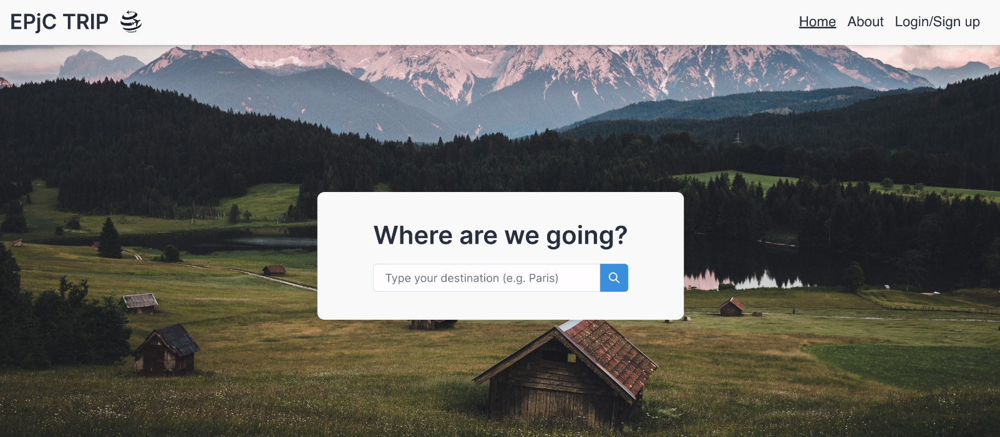

Epjc Trip

This web application is the perfect tool for anyone planning a trip to a new city. With our platform, you can easily create a personalized travel planner tailored to your interests and preferences. Browse through a vast selection of activities and attractions to do in the city, including museums, parks, and more.

But that's not all. We also care about the environment and encourage sustainable travel. That's why our platform offers a carbon footprint calculator, allowing you to estimate the emissions produced during your trip. With this information, you can make informed decisions to reduce your impact and travel more responsibly.

So if you're looking to explore a new city while minimizing your carbon footprint, our web application is the perfect solution for you. Start planning your next adventure today!

This front-end part of the project was built with React library and Typescript programming language.

  

